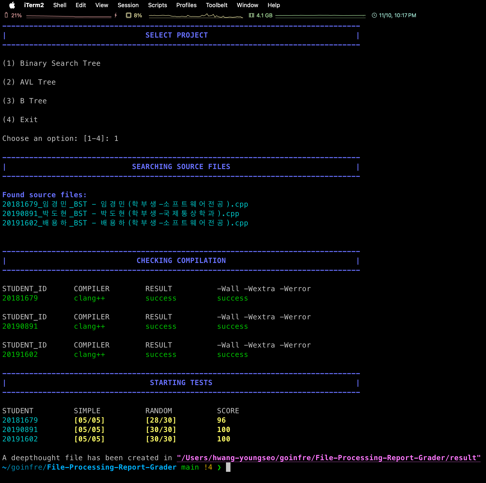

# File Processing Report Tester (ver 2024) - 조교

이 레포지토리는 조교를 위한 비공개 레포지토리입니다.

이 레포지토리는 국민대학교 파일처리 레포트 과제를 위한 채점기를 제공합니다.

이 채점기는 MacOS 위에서 개발되었습니다. 다른 운영체제에서는 정상적으로 작동하지 않을 수 있습니다. Github Actions를 통해 같은 환경의 OS에서 채점을 진행할 수 있습니다.

❗️Github Actions 동작 여부는 확인하지 못했습니다❗️

</br>



<div>
	<strong>소스 파일은 </strong>
	<code>C/C++ 언어</code> 
	<strong>로 작성되어야 합니다.</strong>
	</br>
	</br>
	<p>채점 스크립트는 아래의 항목들을 검사합니다.</p>
	<ul>
		<li>소스 파일 컴파일 테스트</li>
		<li>아래의 컴파일 옵션을 통해 학생들의 코드에 대한 힌트를 얻을 수 있습니다.</li>
	    <ul>
	    	<li><code>-Wall -Wextra -Werror</code></li>
		</ul>
		<li>학생들이 제출한 프로그램의 결과물을 확인합니다.</li>
	</ul>
	<p>테스트가 마무리 된 후, 각 학생들의 실행 결과와 에러가 담긴 <code>deepthought</code> 파일이 생성됩니다.</p>
	<p>❗️ 최종 점수 산출에는 채점기 결과 외의 채점 기준도 포함해주세요 ❗️</p>
</div>

</br>
</br>
</br>
</br>
</br>
</br>

# 2024 Grading Criteria

테스트케이스 채점 결과: 0 - 100점

Leak 발생: 테스트케이스 채점 결과에서 20점 감점

입출력 오류: 테스트케이스 채점 결과에서 20점 감점

최종 점수: 30 + 0.7 \* (테스트케이스 채점 결과 - Leak 발생 - 입출력 오류)

</br>

# Platform

Github Actions를 사용하지 않는다면, 다음의 플랫폼 요구사항을 참고해주세요.

</br>

## Operating System

MacOS-sequoia15.0

</br>

## Compiler

Apple clang version 16.0.0 (clang-1600.0.26.3)

Target: arm64-apple-darwin24.1.0

Thread model: posix

InstalledDir: /Library/Developer/CommandLineTools/usr/bin

</br>

## Software Development Kit (SDK)

이 채점기는 아래의 `비표준 개발자 도구`로 개발되었습니다. 다른 개발자 도구를 사용하실 경우, 정상적으로 작동하지 않을 수 있습니다.

```
$ ls /Library/Developer/CommandLineTools/SDKs

MacOSX.sdk MacOSX14.5.sdk MacOSX14.sdk MacOSX15.0.sdk MacOSX15.sdk
```

</br>
</br>
</br>
</br>

# Getting Started

## Installation

### Local machine

`로컬 환경`에서 채점기를 실행하시려면 아래의 커맨드를 통해 클론해주세요. 위에서 언급한 환경에서만 정상적으로 작동합니다.

```
git clone https://github.com/KMU-File-Processing/File-Processing-Report-Grader.git
```

</br>

### Github Actions (추천)

`Github Actions`를 통해 채점기를 실행할 수 있습니다.

</br>

## Configuration

학생들의 소스파일을 [student](./student) 디렉토리 내에 올바른 프로젝트 디렉토리에 위치시켜주세요. 혹은 `my_config.sh` 파일을 수정하여 다른 디렉토리로 변경할 수 있습니다.

</br>

## Test cases

테스트케이스는 [testcase](./testcase) 디렉토리에 위치해있습니다. 기본적으로 simple test case가 포함되어 있습니다. 채점기 실행 도중 random test case를 추가로 생성하여 테스트합니다. 더 자세한 내용은 [testcase](./testcase) 디렉토리에서 확인하실 수 있습니다.

</br>
</br>
</br>
</br>

# Running script

아래의 커맨드로 채점기를 실행하실 수 있습니다.

```
bash grademe.sh
```

</br>
</br>

아래와 같이 절대경로로도 실행하실 수 있습니다.

```
bash /path/where/you/cloned/grademe.sh
```

</br>

## Github Actions

### Test automatically

`student` 디렉토리에 학생들의 소스파일을 업로드하시면, Github Actions를 통해 자동으로 채점이 진행됩니다.
기본적으로 채점하는 프로젝트는 `__bstree`로 설정되어있습니다. 다른 프로젝트를 채점하고 싶으시다면, [main.yml](.github/workflows/main.yml) 파일을 수정해주세요.

</br>

### Test manually

아래의 `커맨드`를 사용하거나 `Actions` 탭에서 프로젝트를 선택하여 채점하실 수 있습니다.

```
gh workflow run main.yml -f project="project_name_to_grade"
```

</br>

### Result

`Actions` 탭에서 채점 결과를 확인하실 수 있습니다. 또한, 각 학생들의 실행 결과와 에러가 담긴 `deepthought` 파일이 `artifacts` 섹션에 생성됩니다.

</br>
</br>
</br>
</br>

# License

이 프로젝트는 MIT License로 보호받고 있습니다. - 자세한 내용은 [LICENSE](LICENSE)에서 확인하실 수 있습니다.

</br>
</br>
</br>
</br>

# Contact

질문이 있으시다면 다음 메일로 편하게 연락주세요 <mailto:younganswer@kookmin.ac.kr>

</br>

모든 contribution은 환영합니다.
